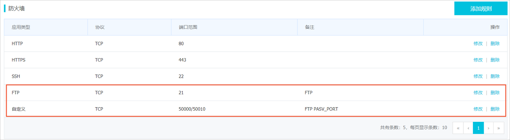

# 安全组配置

搭建好FTP站点后，在Linux服务器的防火墙中，需要放行下列FTP端口。具体操作，请参见[添加防火墙规则](https://help.aliyun.com/document_detail/59086.htm#section-zy8-x7r-9pl)。

被动模式需开放21端口，以及配置文件/etc/vsftpd/vsftpd.conf中参数`pasv_min_port`和`pasv_max_port`之间的所有端口。配置详情如下表所示。

| 应用类型 | 协议 | 端口范围                                         |
| :------- | :--- | :----------------------------------------------- |
| FTP      | TCP  | 21                                               |
| 自定义   | TCP  | `pasv_min_port/pasv_max_port`。例如：50000/50010 |

配置完成后，如下图所示：

