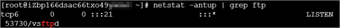

# 安装与配置

1. 远程连接Linux服务器。

   具体操作，请参见[远程连接Linux服务器](https://help.aliyun.com/document_detail/59083.htm#multiTask1826)。本示例中，将通过管理控制台远程连接Linux服务器，并切换至`root`用户进行后续操作。

   **说明** 通过管理控制台远程连接Linux服务器时，您的身份为普通用户。如果不切换至`root`用户，运行部分命令时可能出现Error: This command has to be run under the root user.的报错。

   1. 远程连接Linux服务器后，运行以下命令，切换至`root`用户。

      ```
      sudo su root
      ```

   2. 运行以下命令，返回至`root`用户的根目录。

      ```
      cd
      ```

      完整的命令行操作示例如下图所示：

      **说明** 通过以上命令行操作切换至`root`用户后，如果您需要返回至普通用户，请运行**exit**命令。

2. 运行以下命令，安装vsftpd。

   ```
   yum install -y vsftpd
   ```

   出现如下图所示信息，表示vsftpd安装成功。

3. 运行以下命令，设置FTP服务开机自启动。

   ```
   systemctl enable vsftpd.service
   ```

4. 运行以下命令，启动FTP服务。

   ```
   systemctl start vsftpd.service
   ```

5. 运行以下命令，查看FTP服务的端口号。

   ```
   netstat -antup | grep ftp
   ```

   如下图所示，可查看到FTP服务的端口号，表示服务已正常启动。
