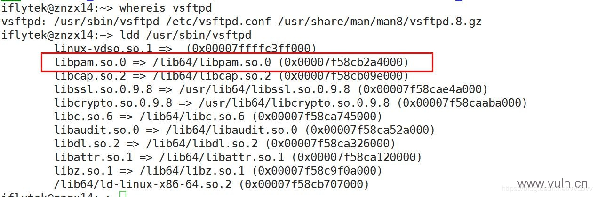

# 问题解决

1. 默认情况下 vsftp 只允许匿名登录 更改配置文件 /etc/vsftpd.conf中 local_enable=YES
2. vsftp 使用PAM 进行验证 运行ldd /usr/sbin/vsftpd 看是否调用 pam，如下：先找vsftpd服务快捷方式在哪
   
   如果调用pam 需要将 源代码路径下的vsftpd.pam 拷贝到/etc/pam.d路径下
   如果找不到这个文件，直接如下命令找到该文件。

```java
find / -name "vsftpd.pam"
1
```

vi /etc/vsftpd.conf 最后一行添加：
**pam_service_name=vsftpd（或者vsftpd.pam）【重点】**
最后重启服务，一般都能够解决该问题
对于vsftp建立用户，就是直接在系统上建立用户，然后直接控制该用户的权限即可，如禁止ssh登陆。
