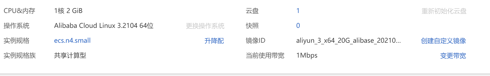

# 前言

## 前提条件

在搭建FTP服务之前需要已创建Linux服务器，笔者此处使用阿里云服务器，配置参数如下图所示。

## 背景信息

FTP（File Transfer Protocol）是一种文件传输协议，基于客户端/服务器架构，支持以下两种工作模式：

- 主动模式（PORT）：客户端向FTP服务器发送端口信息，由服务器主动连接该端口。
- 被动模式（PASV）：FTP服务器开启并发送端口信息给客户端，由客户端连接该端口，服务器被动接受连接。

FTP支持以下三种认证模式：

- 匿名用户模式：任何人无需密码验证就可以直接登录FTP服务器。该模式不安全，一般只用来传输不重要的公开文件，不推荐在生产环境中使用。
- 本地用户模式：通过Linux系统本地用户验证登录权限，相较于匿名用户模式更安全。
- 虚拟用户模式：通过虚拟用户验证登录权限，虚拟用户只能访问Linux系统为其提供的FTP服务，而不能访问Linux系统的其它资源。该模式相较于其他两种模式更加安全，如果您对服务器的数据有较高的安全性要求，建议在相关专业人员的指导下，自行配置该模式。

本文主要介绍配置简单的匿名用户模式以及较为安全的本地用户模式。

